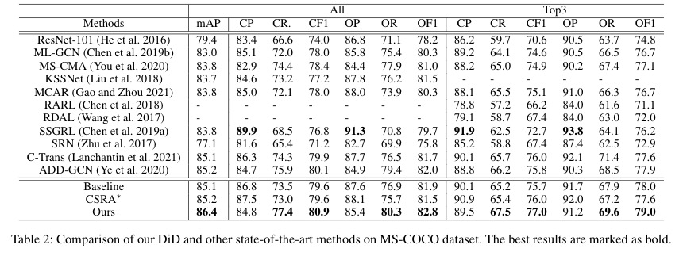
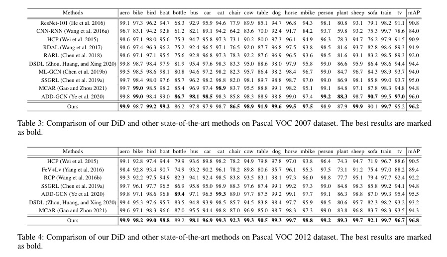

## Introduction

This  reposity contains the train code for our work **[Diverse Instance Discovery: Vision-Transformer for Instance-Aware Multi-Label Image Recognition](https://arxiv.org/abs/2204.10731)**（Accepted by ICME 2022). Our goal is to leverage ViT's patch tokens and self-attention mechanism to mine rich instances in multi-label images, named diverse instance discovery (DiD). To this end, we propose a semantic category-aware module and a spatial relationship-aware module, respectively, and then combine the two by a re-constraint strategy to obtain instance-aware attention maps. Finally, we propose a weakly supervised object localization-based approach to extract multi-scale local features, to form a multi-view pipeline. Our method requires only weakly supervised information at the label level, no additional knowledge injection or other strongly supervised information is required. Experiments on three benchmark datasets show that our method significantly outperforms previous works and achieves state-of-the-art results under fair experimental comparisons.

### My Paper Title

**Diverse Instance Discovery: Vision-Transformer for Instance-Aware Multi-Label Image Recognition**

## Results
#### Results on MS-COCO



#### Results on PASCAL VOC 2007 and PASCAL VOC2012



## Usage

#### Train on MS-COCO

To run this code, you need 8 GPU (32G memory $\times$ 8), or try to reduce your batch size. Make sure a floder named 'augments_DP' has been created. **Note: If your GPU memory keeps increasing when running the code, try lowering the pytorch version!**
```
sh DP_run.sh
```
## Related work

[TS-CAM](https://arxiv.org/abs/2103.14862)

[MCAR](https://arxiv.org/abs/2103.14862)

